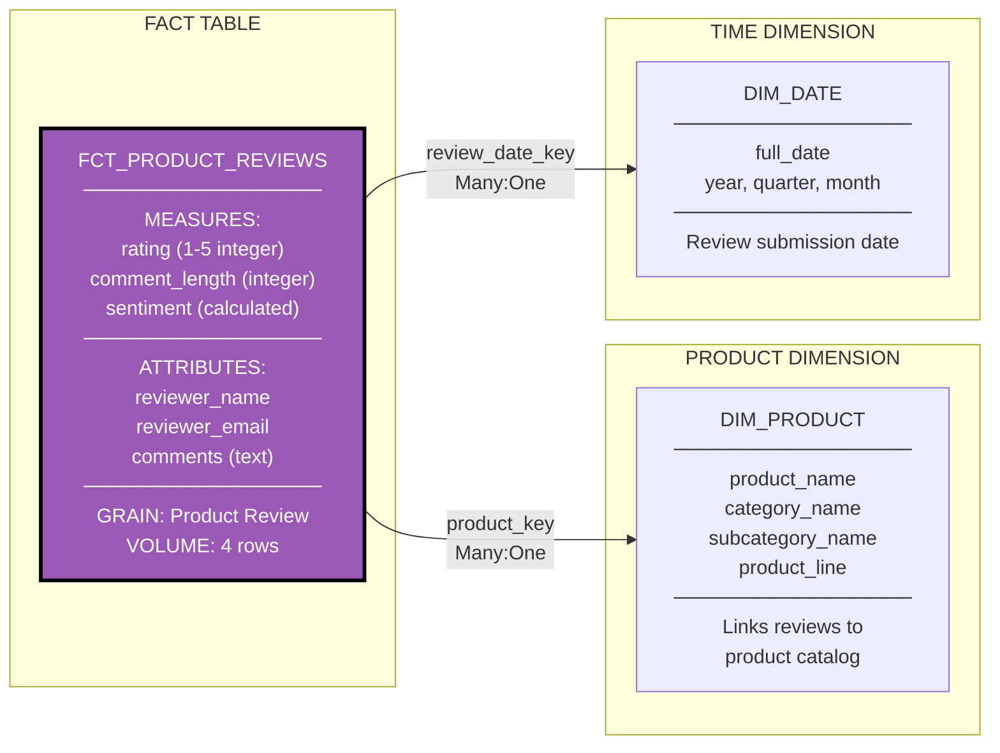
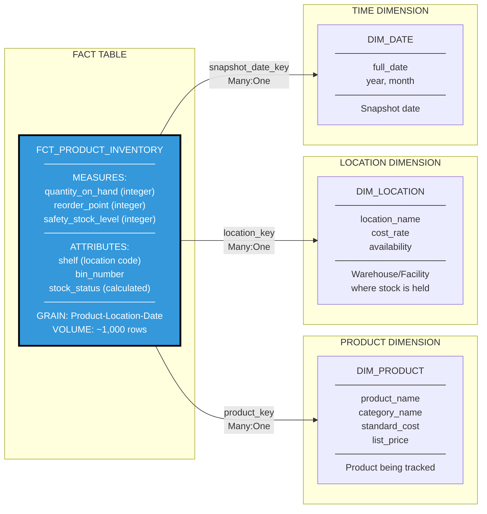
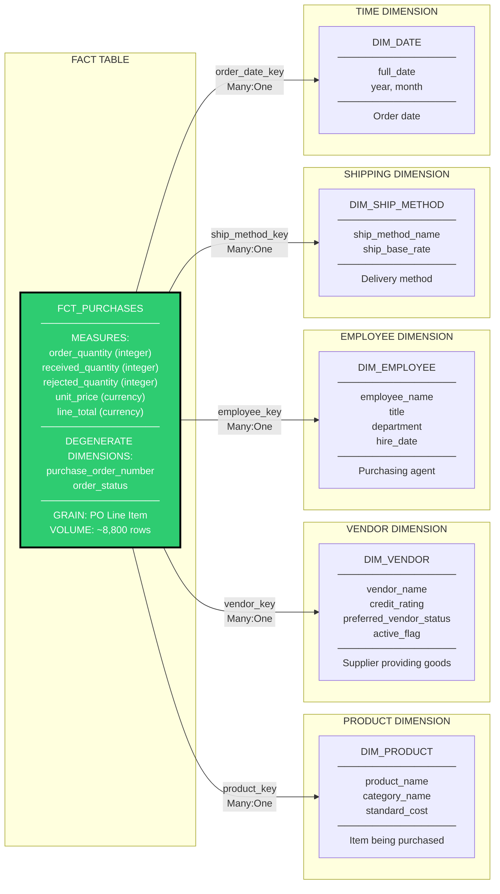
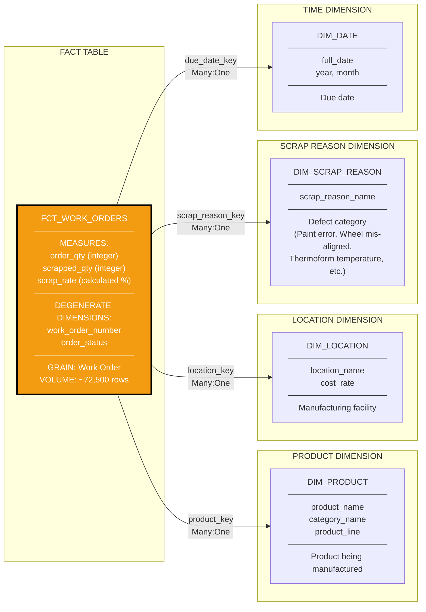

# Adventure Works Dimensional Model - Entity Relationship Diagrams

## Document Purpose

This document provides comprehensive visual representations of the Adventure Works dimensional data model. It illustrates the star schema architecture, showing how fact tables (transactional data) relate to dimension tables (descriptive attributes). These diagrams serve as the blueprint for the data warehouse implementation.

**Key Concepts:**
- **Star Schema**: A dimensional modeling approach where a central fact table connects to multiple dimension tables, resembling a star pattern
- **Fact Table**: Contains quantitative measures (metrics) of business processes at a specific grain (level of detail)
- **Dimension Table**: Contains descriptive attributes that provide context to facts (who, what, where, when, why, how)
- **Conformed Dimensions**: Dimensions shared across multiple fact tables with consistent definitions
- **Grain**: The level of detail captured in a fact table (e.g., one row per order line item)
- **Surrogate Key**: System-generated integer used as primary key, independent of source system keys

---

## 1. Constellation Schema Overview

### Description
The complete Adventure Works dimensional model follows a constellation schema (also called galaxy schema), which is a collection of multiple star schemas sharing common dimensions. This design supports multiple business processes while maintaining dimensional consistency.

### Business Processes Covered
1. **Sales**: Customer orders and revenue generation
2. **Product Reviews**: Customer feedback and product ratings
3. **Inventory**: Stock levels and warehouse management
4. **Purchasing**: Vendor orders and procurement
5. **Manufacturing**: Production work orders and quality tracking

### Conformed Dimensions
The following dimensions are shared across multiple business processes:
- **DIM_DATE**: Time dimension (role-playing for different date types)
- **DIM_PRODUCT**: Product catalog with categories and hierarchies
- **DIM_EMPLOYEE**: Employee information used in sales and purchasing

```mermaid
graph TB
    subgraph "FACT TABLES - Transactional Data"
        FCT_SALES["FCT_SALES<br/>Sales Transactions<br/>Grain: Order Line Item<br/>~121,000 rows"]
        FCT_INVENTORY["FCT_PRODUCT_INVENTORY<br/>Inventory Snapshots<br/>Grain: Product-Location-Date<br/>~1,000 rows"]
        FCT_PURCHASES["FCT_PURCHASES<br/>Purchase Orders<br/>Grain: PO Line Item<br/>~8,800 rows"]
        FCT_WORK["FCT_WORK_ORDERS<br/>Production Orders<br/>Grain: Work Order<br/>~72,500 rows"]
        FCT_REVIEWS["FCT_PRODUCT_REVIEWS<br/>Customer Feedback<br/>Grain: Product Review<br/>4 rows"]
    end
  
    subgraph "CONFORMED DIMENSIONS - Shared Across Facts"
        DIM_DATE["DIM_DATE<br/>Time Dimension<br/>Role-Playing<br/>1,461 rows (2011-2014)"]
        DIM_PRODUCT["DIM_PRODUCT<br/>Product Catalog<br/>Categories & Hierarchies<br/>~504 rows"]
        DIM_EMPLOYEE["DIM_EMPLOYEE<br/>Employee Directory<br/>Sales & Purchasing<br/>290 rows"]
    end
  
    subgraph "SALES-SPECIFIC DIMENSIONS"
        DIM_CUSTOMER["DIM_CUSTOMER<br/>Customer Master<br/>Individual & Store<br/>~19,800 rows"]
        DIM_TERRITORY["DIM_TERRITORY<br/>Sales Territories<br/>Geographic Regions<br/>10 rows"]
        DIM_SALESPERSON["DIM_SALESPERSON<br/>Sales Representatives<br/>Commission Tracking<br/>17 rows"]
        DIM_ADDRESS["DIM_ADDRESS<br/>Geographic Locations<br/>Role-Playing<br/>~19,600 rows"]
        DIM_SHIP["DIM_SHIP_METHOD<br/>Shipping Options<br/>Carrier Methods<br/>5 rows"]
        DIM_OFFER["DIM_SPECIAL_OFFER<br/>Promotions<br/>Discounts & Campaigns<br/>16 rows"]
        DIM_CARD["DIM_CREDIT_CARD<br/>Payment Methods<br/>Card Types<br/>19 rows"]
        DIM_CURR["DIM_CURRENCY<br/>Currency Codes<br/>Exchange Rates<br/>105 rows"]
    end
  
    subgraph "OPERATIONS DIMENSIONS"
        DIM_VENDOR["DIM_VENDOR<br/>Supplier Master<br/>Vendor Profiles<br/>104 rows"]
        DIM_LOCATION["DIM_LOCATION<br/>Facilities<br/>Warehouses & Plants<br/>14 rows"]
        DIM_SCRAP["DIM_SCRAP_REASON<br/>Quality Issues<br/>Defect Categories<br/>16 rows"]
    end
  
    %% Sales Relationships - Many to One
    FCT_SALES -->|order_date_key| DIM_DATE
    FCT_SALES -->|product_key| DIM_PRODUCT
    FCT_SALES -->|customer_key| DIM_CUSTOMER
    FCT_SALES -->|territory_key| DIM_TERRITORY
    FCT_SALES -->|salesperson_key| DIM_SALESPERSON
    FCT_SALES -->|bill_to_address_key| DIM_ADDRESS
    FCT_SALES -->|ship_method_key| DIM_SHIP
    FCT_SALES -->|special_offer_key| DIM_OFFER
    FCT_SALES -->|credit_card_key| DIM_CARD
    FCT_SALES -->|currency_key| DIM_CURR
  
    %% Inventory Relationships
    FCT_INVENTORY -->|snapshot_date_key| DIM_DATE
    FCT_INVENTORY -->|product_key| DIM_PRODUCT
    FCT_INVENTORY -->|location_key| DIM_LOCATION
  
    %% Purchases Relationships
    FCT_PURCHASES -->|order_date_key| DIM_DATE
    FCT_PURCHASES -->|product_key| DIM_PRODUCT
    FCT_PURCHASES -->|vendor_key| DIM_VENDOR
    FCT_PURCHASES -->|employee_key| DIM_EMPLOYEE
    FCT_PURCHASES -->|ship_method_key| DIM_SHIP
  
    %% Work Orders Relationships
    FCT_WORK -->|due_date_key| DIM_DATE
    FCT_WORK -->|product_key| DIM_PRODUCT
    FCT_WORK -->|location_key| DIM_LOCATION
    FCT_WORK -->|scrap_reason_key| DIM_SCRAP
  
    %% Reviews Relationships
    FCT_REVIEWS -->|review_date_key| DIM_DATE
    FCT_REVIEWS -->|product_key| DIM_PRODUCT
  
    %% Styling for visual hierarchy
    style FCT_SALES fill:#e74c3c,stroke:#000,stroke-width:3px,color:#fff
    style FCT_INVENTORY fill:#3498db,stroke:#000,stroke-width:2px,color:#fff
    style FCT_PURCHASES fill:#2ecc71,stroke:#000,stroke-width:2px,color:#fff
    style FCT_WORK fill:#f39c12,stroke:#000,stroke-width:2px,color:#fff
    style FCT_REVIEWS fill:#9b59b6,stroke:#000,stroke-width:2px,color:#fff
  
    style DIM_DATE fill:#f1c40f,stroke:#000,stroke-width:2px
    style DIM_PRODUCT fill:#f1c40f,stroke:#000,stroke-width:2px
    style DIM_EMPLOYEE fill:#f1c40f,stroke:#000,stroke-width:2px
```



**Legend:**
- **Red (Bold Border)**: Primary fact table (Sales) - highest transaction volume
- **Blue/Green/Orange/Purple**: Supporting fact tables for specific business processes
- **Yellow**: Conformed dimensions shared across multiple facts
- **White**: Process-specific dimensions
- **Arrows**: Many-to-one relationships (foreign key → primary key)

---

## 2. Sales Analysis Star Schema

### Business Purpose
Supports comprehensive sales analytics including revenue analysis, product performance, customer behavior, and salesperson effectiveness. This is the primary analytical focus for the organization.

### Grain Definition
**One row per sales order line item** - The most detailed level of sales transactions, allowing aggregation to any higher level (order, customer, product, period).

### Key Analytical Questions Supported
- What are total sales by product category over time?
- Which customers generate the most revenue?
- How do different territories compare in sales performance?
- What is the impact of promotions on sales?
- Which salespersons exceed their quotas?

### Fact Table Metrics
- **line_total**: Extended price (quantity × unit price - discount)
- **order_quantity**: Units sold
- **unit_price**: Selling price per unit
- **discount_amount**: Total discount applied
- **tax_amount**: Tax collected
- **freight**: Shipping charges
- **gross_profit**: Revenue minus cost of goods sold

```mermaid
graph LR
    subgraph "FACT TABLE"
        SALES["FCT_SALES<br/>─────────────────<br/>MEASURES:<br/>line_total (currency)<br/>order_quantity (integer)<br/>unit_price (currency)<br/>discount_amount (currency)<br/>tax_amount (currency)<br/>freight (currency)<br/>gross_profit (calculated)<br/>─────────────────<br/>DEGENERATE DIMENSIONS:<br/>sales_order_number<br/>purchase_order_number<br/>online_order_flag<br/>order_status<br/>─────────────────<br/>GRAIN: Order Line Item<br/>VOLUME: ~121,000 rows"]
    end
  
    subgraph "TIME DIMENSIONS - Role-Playing"
        DATE1["DIM_DATE<br/>Role: Order Date<br/>─────────────────<br/>full_date<br/>year, quarter, month<br/>day_name, is_weekend<br/>fiscal_period"]
        DATE2["DIM_DATE<br/>Role: Ship Date<br/>─────────────────<br/>(Same attributes)"]
        DATE3["DIM_DATE<br/>Role: Due Date<br/>─────────────────<br/>(Same attributes)"]
    end
  
    subgraph "PRODUCT DIMENSION"
        PROD["DIM_PRODUCT<br/>─────────────────<br/>product_name<br/>product_number<br/>category_name<br/>subcategory_name<br/>color, size<br/>standard_cost<br/>list_price<br/>product_line<br/>─────────────────<br/>HIERARCHY:<br/>Category → Subcategory → Product"]
    end
  
    subgraph "CUSTOMER DIMENSION"
        CUST["DIM_CUSTOMER<br/>─────────────────<br/>customer_name<br/>customer_type (Individual/Store)<br/>city, state_province<br/>country_region<br/>phone, email<br/>─────────────────<br/>TYPES:<br/>Individual Customers<br/>Store/Business Customers"]
    end
  
    subgraph "GEOGRAPHY DIMENSION"
        TERR["DIM_TERRITORY<br/>─────────────────<br/>territory_name<br/>country_region<br/>sales_group<br/>sales_ytd<br/>sales_last_year"]
    end
  
    subgraph "SALES DIMENSION"
        SALESP["DIM_SALESPERSON<br/>─────────────────<br/>salesperson_name<br/>territory_name<br/>sales_quota<br/>bonus<br/>commission_pct<br/>sales_ytd"]
    end
  
    subgraph "LOCATION DIMENSIONS - Role-Playing"
        ADDR1["DIM_ADDRESS<br/>Role: Bill To<br/>─────────────────<br/>address_line1/2<br/>city, state_province<br/>country_region<br/>postal_code"]
        ADDR2["DIM_ADDRESS<br/>Role: Ship To<br/>─────────────────<br/>(Same attributes)"]
    end
  
    subgraph "TRANSACTIONAL DIMENSIONS"
        SHIP["DIM_SHIP_METHOD<br/>─────────────────<br/>ship_method_name<br/>ship_base_rate<br/>ship_rate"]
        
        OFFER["DIM_SPECIAL_OFFER<br/>─────────────────<br/>offer_description<br/>discount_pct<br/>offer_type<br/>category<br/>start_date<br/>end_date"]
        
        CARD["DIM_CREDIT_CARD<br/>─────────────────<br/>card_type<br/>card_number (masked)<br/>expiry_month/year"]
        
        CURR["DIM_CURRENCY<br/>─────────────────<br/>currency_code<br/>currency_name<br/>exchange_rate"]
    end
  
    %% Relationships with cardinality
    SALES -->|order_date_key<br/>Many:One| DATE1
    SALES -->|ship_date_key<br/>Many:One| DATE2
    SALES -->|due_date_key<br/>Many:One| DATE3
    SALES -->|product_key<br/>Many:One| PROD
    SALES -->|customer_key<br/>Many:One| CUST
    SALES -->|territory_key<br/>Many:One| TERR
    SALES -->|salesperson_key<br/>Many:One| SALESP
    SALES -->|bill_to_address_key<br/>Many:One| ADDR1
    SALES -->|ship_to_address_key<br/>Many:One| ADDR2
    SALES -->|ship_method_key<br/>Many:One| SHIP
    SALES -->|special_offer_key<br/>Many:One| OFFER
    SALES -->|credit_card_key<br/>Many:One| CARD
    SALES -->|currency_key<br/>Many:One| CURR
  
    style SALES fill:#e74c3c,stroke:#000,stroke-width:3px,color:#fff
```



**Role-Playing Dimensions Explained:**
- **DIM_DATE**: Used three times with different meanings (order, ship, due dates)
- **DIM_ADDRESS**: Used twice for billing and shipping addresses
- Same dimension table referenced multiple times with different foreign keys

**Degenerate Dimensions:**
Fields that don't justify their own dimension table and remain in the fact table:
- sales_order_number: Transaction identifier
- purchase_order_number: Customer's PO reference
- online_order_flag: Channel indicator
- order_status: Transaction state

---

## 3. Product Reviews Star Schema

### Business Purpose
Analyzes customer feedback, product ratings, and sentiment to inform product development and quality improvements.

### Grain Definition
**One row per product review** - Each customer review submission is a separate record.

### Key Analytical Questions
- What is the average rating by product category?
- Which products have the most reviews?
- How does sentiment vary across product lines?
- Are there trends in ratings over time?

### Fact Table Metrics
- **rating**: Customer rating (1-5 scale)
- **comment_length**: Length of review text
- **sentiment**: Calculated field (Positive/Neutral/Negative)



**Business Rules:**
- Sentiment Calculation: Rating ≥4 = Positive, Rating=3 = Neutral, Rating <3 = Negative
- One review per customer per product (enforced at source)
- Comments are optional but encouraged

---

## 4. Inventory Management Star Schema

### Business Purpose
Tracks inventory levels across warehouses and facilities to support stock management, reorder planning, and supply chain optimization.

### Grain Definition
**One row per product-location-snapshot date** - Point-in-time inventory levels for each product at each location.

### Key Analytical Questions
- What products are below reorder point?
- Which locations have excess inventory?
- How does inventory turnover vary by product category?
- What is the total inventory value by location?

### Fact Table Metrics
- **quantity_on_hand**: Current stock level
- **reorder_point**: Minimum threshold before reorder
- **safety_stock_level**: Buffer inventory amount
- **stock_status**: Calculated category (Out of Stock/Low/Medium/Well Stocked)



**Stock Status Business Rules:**
- Out of Stock: quantity_on_hand = 0
- Low Stock: quantity_on_hand < 10
- Medium Stock: 10 ≤ quantity_on_hand < 50
- Well Stocked: quantity_on_hand ≥ 50

**Snapshot Nature:**
This is a periodic snapshot fact table, capturing inventory state at specific points in time rather than recording every transaction.

---

## 5. Purchasing Analysis Star Schema

### Business Purpose
Manages vendor relationships, procurement efficiency, and purchase order tracking to optimize supplier performance and costs.

### Grain Definition
**One row per purchase order line item** - Detailed procurement transactions at the line item level.

### Key Analytical Questions
- Which vendors provide the best value?
- What is the average lead time by vendor?
- How much are we spending by product category?
- What is the rejection rate by vendor?

### Fact Table Metrics
- **order_quantity**: Units ordered
- **received_quantity**: Units actually received
- **rejected_quantity**: Units rejected (quality issues)
- **unit_price**: Purchase price per unit
- **line_total**: Extended purchase cost



**Quality Metrics:**
- Acceptance Rate = (received_quantity - rejected_quantity) / received_quantity
- Fulfillment Rate = received_quantity / order_quantity
- Used to evaluate vendor performance

---

## 6. Manufacturing Work Orders Star Schema

### Business Purpose
Tracks production efficiency, quality issues, and manufacturing performance to identify process improvements and reduce waste.

### Grain Definition
**One row per work order** - Each production order for manufacturing a product.

### Key Analytical Questions
- What is the scrap rate by product?
- Which locations have quality issues?
- What are the most common scrap reasons?
- How does actual production compare to planned?

### Fact Table Metrics
- **order_qty**: Planned production quantity
- **scrapped_qty**: Units scrapped (defective)
- **scrap_rate**: Calculated percentage (scrapped / ordered)



**Scrap Rate Calculation:**
```
scrap_rate = (scrapped_qty / order_qty) × 100
```
Target is typically <2% for acceptable quality

**NULL Handling:**
scrap_reason_key is NULL when scrapped_qty = 0 (no defects)

---

## 7. Dimension Table Details

### DIM_DATE - Time Dimension

**Purpose:** Provides comprehensive date attributes for temporal analysis. Role-playing dimension used in all fact tables.

**Structure:**
```
Primary Key: date_key (INT64, format: YYYYMMDD)
Examples: 20110101, 20140315

Attributes:
├── full_date (DATE): Actual calendar date
├── Calendar Attributes:
│   ├── year (INT64): 2011-2014
│   ├── quarter (INT64): 1-4
│   ├── month_number (INT64): 1-12
│   ├── month_name (STRING): January-December
│   ├── day_of_month (INT64): 1-31
│   └── day_name (STRING): Monday-Sunday
├── Derived Attributes:
│   └── is_weekend (BOOLEAN): TRUE for Saturday/Sunday
└── Business Attributes:
    └── fiscal_period (STRING): For non-calendar fiscal years
```

**Generation Method:** Date spine from 2011-01-01 to 2014-12-31 (1,461 days)

**Role-Playing Usage:**
- order_date_key (when customer placed order)
- ship_date_key (when order shipped)
- due_date_key (expected delivery)
- review_date_key (feedback submitted)
- snapshot_date_key (inventory recorded)

---

### DIM_PRODUCT - Product Catalog

**Purpose:** Central product master with hierarchical structure for product analysis.

**Hierarchy:**
```
Level 1: Category (4 values)
  ├── Bikes
  ├── Components
  ├── Clothing
  └── Accessories
    └── Level 2: Subcategory (37 values)
        ├── Road Bikes, Mountain Bikes, Touring Bikes
        ├── Wheels, Brakes, Chains
        └── etc.
          └── Level 3: Product (~504 values)
              └── Individual SKUs
```

**Key Attributes:**
```
Primary Key: product_key (INT64, surrogate)
Natural Key: product_id (INT64, from source system)

Descriptive Attributes:
├── Identification:
│   ├── product_name (STRING)
│   ├── product_number (STRING): SKU
│   └── product_line (STRING): R/M/T/S
├── Hierarchy:
│   ├── category_name (STRING)
│   ├── category_id (INT64)
│   ├── subcategory_name (STRING)
│   └── subcategory_id (INT64)
├── Physical:
│   ├── color (STRING)
│   ├── size (STRING)
│   └── weight (NUMERIC)
└── Financial:
    ├── standard_cost (NUMERIC): Production cost
    └── list_price (NUMERIC): MSRP
```

**Slowly Changing Dimension (SCD) Type 1:** Overwrites existing data, no history maintained in POC.

---

### DIM_CUSTOMER - Customer Master

**Purpose:** Unified customer view for individual consumers and business accounts.

**Customer Types:**
```
Type 1: Individual (Person)
  └── Single consumer purchases

Type 2: Store (Business)
  └── Corporate/retail accounts
```

**Key Attributes:**
```
Primary Key: customer_key (INT64, surrogate)
Natural Key: customer_id (INT64)

Attributes:
├── Identification:
│   ├── customer_name (STRING)
│   ├── customer_type (STRING): Individual/Store
│   └── account_number (STRING)
├── Contact:
│   ├── email_address (STRING)
│   ├── phone (STRING)
│   └── contact_person (for stores)
└── Geography:
    ├── city (STRING)
    ├── state_province (STRING)
    ├── country_region (STRING)
    └── postal_code (STRING)
```

**NULL Handling:** Individual customers may lack some business fields (e.g., contact_person)

---

### DIM_TERRITORY - Sales Territories

**Purpose:** Geographic sales regions for territory-based analysis and commission allocation.

**Structure:**
```
Primary Key: territory_key (INT64, surrogate)
Natural Key: territory_id (INT64)

Attributes:
├── Geography:
│   ├── territory_name (STRING): Northwest, Southwest, etc.
│   ├── country_region (STRING): United States, Canada, etc.
│   └── sales_group (STRING): North America, Europe, Pacific
└── Performance Metrics (current period):
    ├── sales_ytd (NUMERIC)
    └── sales_last_year (NUMERIC)
```

**Slowly Changing Dimension:** Performance metrics updated regularly (SCD Type 1)

---

### DIM_LOCATION - Facilities

**Purpose:** Warehouses, manufacturing plants, and distribution centers.

**Key Attributes:**
```
Primary Key: location_key (INT64, surrogate)
Natural Key: location_id (INT64)

Attributes:
├── location_name (STRING): "Tool Crib", "Frame Forming", etc.
├── cost_rate (NUMERIC): Hourly operational cost
└── availability (NUMERIC): Operating hours per day
```

**Usage:** Inventory (storage) and Manufacturing (production)

---

## 8. Data Model Specifications

### Naming Conventions

**Tables:**
- Fact tables: Prefix `fct_` (e.g., fct_sales)
- Dimension tables: Prefix `dim_` (e.g., dim_product)
- All lowercase with underscores

**Fields:**
- Primary keys: `table_name_key` (e.g., product_key)
- Foreign keys: Same name as referenced primary key
- Attributes: Descriptive lowercase with underscores

### Data Types (BigQuery)

| Data Type | Usage | Example |
|-----------|-------|---------|
| INT64 | Keys, quantities, counts | product_key, order_quantity |
| NUMERIC | Currency, precise decimals | line_total, unit_price |
| STRING | Text fields | product_name, customer_name |
| DATE | Calendar dates | full_date |
| BOOLEAN | Flags | is_weekend, online_order_flag |
| TIMESTAMP | Audit fields | created_at, modified_at |

### Key Strategies

**Surrogate Keys:**
- System-generated integers
- Independent of source systems
- Generated using DENSE_RANK() or ROW_NUMBER()
- Allows handling of source system changes

**Natural Keys:**
- Preserved from source system
- Used for lookups and reconciliation
- Not used as primary keys in dimensional model

**Date Keys:**
- Format: YYYYMMDD as INT64
- Example: 20140315 = March 15, 2014
- Easier to join than DATE type
- Human-readable

---

## 9. Relationship Cardinalities

All relationships follow standard star schema patterns:

**Many-to-One (N:1):**
- Multiple fact records → Single dimension record
- Example: Many sales transactions → One product
- Enforced through foreign key constraints

**No Many-to-Many:**
- Avoided through proper grain definition
- Bridge tables not used in this design

**Optional vs Required:**
- Most relationships are required (NOT NULL foreign keys)
- Some dimensions optional (e.g., scrap_reason when scrapped_qty=0)
- Outer joins handle optional dimensions in queries

---

## 10. Query Examples

### Example 1: Sales by Product Category and Year
```sql
SELECT 
    p.category_name,
    d.year,
    SUM(f.line_total) AS total_sales,
    COUNT(DISTINCT f.sales_order_id) AS order_count
FROM fct_sales f
JOIN dim_product p ON f.product_key = p.product_key
JOIN dim_date d ON f.order_date_key = d.date_key
GROUP BY p.category_name, d.year
ORDER BY d.year, total_sales DESC;
```

### Example 2: Inventory Below Reorder Point
```sql
SELECT 
    p.product_name,
    l.location_name,
    i.quantity_on_hand,
    i.reorder_point,
    i.stock_status
FROM fct_product_inventory i
JOIN dim_product p ON i.product_key = p.product_key
JOIN dim_location l ON i.location_key = l.location_key
WHERE i.quantity_on_hand < i.reorder_point
ORDER BY p.product_name, l.location_name;
```

### Example 3: Scrap Rate by Product Line
```sql
SELECT 
    p.product_line,
    SUM(w.order_qty) AS total_ordered,
    SUM(w.scrapped_qty) AS total_scrapped,
    ROUND(SUM(w.scrapped_qty) * 100.0 / SUM(w.order_qty), 2) AS scrap_rate_pct
FROM fct_work_orders w
JOIN dim_product p ON w.product_key = p.product_key
WHERE w.order_qty > 0
GROUP BY p.product_line
ORDER BY scrap_rate_pct DESC;
```

---

## 11. Implementation Considerations

### Storage Estimates (BigQuery)

| Table | Row Count | Avg Row Size | Est. Storage |
|-------|-----------|--------------|--------------|
| fct_sales | ~121,000 | 200 bytes | ~24 MB |
| fct_work_orders | ~72,500 | 100 bytes | ~7 MB |
| fct_purchases | ~8,800 | 150 bytes | ~1.3 MB |
| fct_product_inventory | ~1,000 | 120 bytes | ~120 KB |
| fct_product_reviews | 4 | 300 bytes | ~1.2 KB |
| All dimensions | ~40,000 | 300 bytes | ~12 MB |
| **TOTAL** | | | **~45 MB** |

*Small dataset suitable for POC/demonstration purposes*

### Performance Optimization

**Partitioning:**
- Fact tables: Partition by date_key
- Reduces query scan sizes for time-based queries

**Clustering:**
- fct_sales: Cluster by product_key, customer_key
- Improves join performance

**Indexing:**
- Not required in BigQuery (columnar storage)
- Primary/foreign keys for referential integrity only

---

## Document Version

**Version:** 1.0  
**Date:** October 2024  
**Purpose:** Dimensional model blueprint for Adventure Works data warehouse  
**Next Phase:** Source-to-target mapping (Phase 2)

---

## Glossary

**Atomic Grain:** Lowest level of detail in a fact table (most granular)  
**Bridge Table:** Resolves many-to-many relationships (not used in this model)  
**Constellation Schema:** Multiple star schemas sharing conformed dimensions  
**Conformed Dimension:** Dimension used consistently across multiple fact tables  
**Degenerate Dimension:** Dimension attribute stored in fact table (no separate dimension)  
**Fact Table:** Stores quantitative measures of business processes  
**Grain:** Level of detail represented by one row in a fact table  
**Role-Playing Dimension:** Same dimension used multiple times with different meanings  
**Slowly Changing Dimension (SCD):** Dimension that changes over time with history tracking  
**Star Schema:** Dimensional model with fact table at center, dimensions around it  
**Surrogate Key:** System-generated key independent of business keys

---

**End of Document**
