# Adventure Works Star Schema Diagrams

## Overview

This document contains visual representations of the Adventure Works dimensional model, showing the relationships between fact tables and dimension tables in a star schema design.

---

## 1. Complete Constellation Schema (All Fact Tables)

```mermaid
graph TB
    subgraph "FACT TABLES"
        FCT_SALES[("⭐ FCT_SALES<br/>(Primary Fact)<br/>Order Line Items")]
        FCT_INVENTORY[("FCT_PRODUCT_INVENTORY<br/>Daily Snapshots")]
        FCT_PURCHASES[("FCT_PURCHASES<br/>Purchase Orders")]
        FCT_WORK[("FCT_WORK_ORDERS<br/>Production")]
        FCT_REVIEWS[("FCT_PRODUCT_REVIEWS<br/>Customer Feedback")]
    end
  
    subgraph "SHARED DIMENSIONS - Conformed"
        DIM_DATE["📅 DIM_DATE<br/>(Role-Playing)<br/>Time Dimension"]
        DIM_PRODUCT["📦 DIM_PRODUCT<br/>Products & Categories"]
        DIM_EMPLOYEE["👤 DIM_EMPLOYEE<br/>Employees"]
    end
  
    subgraph "SALES DIMENSIONS"
        DIM_CUSTOMER["👥 DIM_CUSTOMER<br/>Customers"]
        DIM_TERRITORY["🌍 DIM_TERRITORY<br/>Sales Territories"]
        DIM_SALESPERSON["💼 DIM_SALESPERSON<br/>Sales Reps"]
        DIM_STORE["🏪 DIM_STORE<br/>Retail Stores"]
        DIM_ADDRESS["📍 DIM_ADDRESS<br/>(Role-Playing)<br/>Addresses"]
        DIM_SHIP["🚚 DIM_SHIP_METHOD<br/>Shipping"]
        DIM_OFFER["🎁 DIM_SPECIAL_OFFER<br/>Promotions"]
        DIM_CARD["💳 DIM_CREDIT_CARD<br/>Payment"]
        DIM_CURR["💱 DIM_CURRENCY<br/>Currency"]
    end
  
    subgraph "MANUFACTURING DIMENSIONS"
        DIM_VENDOR["🏭 DIM_VENDOR<br/>Suppliers"]
        DIM_LOCATION["📍 DIM_LOCATION<br/>Facilities"]
        DIM_SCRAP["⚠️ DIM_SCRAP_REASON<br/>Scrap Reasons"]
    end
  
    %% Sales Fact Relationships
    FCT_SALES --> DIM_DATE
    FCT_SALES --> DIM_PRODUCT
    FCT_SALES --> DIM_CUSTOMER
    FCT_SALES --> DIM_TERRITORY
    FCT_SALES --> DIM_SALESPERSON
    FCT_SALES --> DIM_STORE
    FCT_SALES --> DIM_ADDRESS
    FCT_SALES --> DIM_SHIP
    FCT_SALES --> DIM_OFFER
    FCT_SALES --> DIM_CARD
    FCT_SALES --> DIM_CURR
  
    %% Inventory Fact Relationships
    FCT_INVENTORY --> DIM_DATE
    FCT_INVENTORY --> DIM_PRODUCT
    FCT_INVENTORY --> DIM_LOCATION
  
    %% Purchases Fact Relationships
    FCT_PURCHASES --> DIM_DATE
    FCT_PURCHASES --> DIM_PRODUCT
    FCT_PURCHASES --> DIM_VENDOR
    FCT_PURCHASES --> DIM_EMPLOYEE
    FCT_PURCHASES --> DIM_SHIP
  
    %% Work Orders Fact Relationships
    FCT_WORK --> DIM_DATE
    FCT_WORK --> DIM_PRODUCT
    FCT_WORK --> DIM_LOCATION
    FCT_WORK --> DIM_SCRAP
  
    %% Reviews Fact Relationships
    FCT_REVIEWS --> DIM_DATE
    FCT_REVIEWS --> DIM_PRODUCT
  
    style FCT_SALES fill:#ff6b6b,stroke:#333,stroke-width:4px,color:#fff
    style FCT_INVENTORY fill:#4ecdc4,stroke:#333,stroke-width:2px,color:#fff
    style FCT_PURCHASES fill:#45b7d1,stroke:#333,stroke-width:2px,color:#fff
    style FCT_WORK fill:#96ceb4,stroke:#333,stroke-width:2px,color:#fff
    style FCT_REVIEWS fill:#dda15e,stroke:#333,stroke-width:2px,color:#fff
  
    style DIM_DATE fill:#ffd93d,stroke:#333,stroke-width:2px
    style DIM_PRODUCT fill:#ffd93d,stroke:#333,stroke-width:2px
    style DIM_EMPLOYEE fill:#ffd93d,stroke:#333,stroke-width:2px
```



---

## 2. Primary Star Schema: FCT_SALES (Main Sales Analytics)

```mermaid
graph LR
    subgraph "FACT TABLE"
        SALES[("⭐ FCT_SALES<br/>────────────<br/>Order Line Items<br/>────────────<br/>• order_quantity<br/>• unit_price<br/>• line_total<br/>• discount_amount<br/>• gross_profit<br/>• tax_amount<br/>• freight")]
    end
  
    DATE["📅 DIM_DATE<br/>────────<br/>• order_date<br/>• ship_date<br/>• due_date"]
    PRODUCT["📦 DIM_PRODUCT<br/>────────<br/>• product_name<br/>• category<br/>• subcategory<br/>• list_price<br/>• standard_cost"]
    CUSTOMER["👥 DIM_CUSTOMER<br/>────────<br/>• customer_name<br/>• customer_type<br/>• demographics"]
    TERRITORY["🌍 DIM_TERRITORY<br/>────────<br/>• territory_name<br/>• country<br/>• region_group"]
    SALESPERSON["💼 DIM_SALESPERSON<br/>────────<br/>• full_name<br/>• sales_quota<br/>• sales_ytd"]
    STORE["🏪 DIM_STORE<br/>────────<br/>• store_name<br/>• demographics"]
    ADDRESS["📍 DIM_ADDRESS<br/>────────<br/>• bill_to<br/>• ship_to<br/>• city<br/>• state"]
    SHIP["🚚 DIM_SHIP_METHOD<br/>────────<br/>• method_name<br/>• base_cost<br/>• rate"]
    OFFER["🎁 DIM_SPECIAL_OFFER<br/>────────<br/>• description<br/>• discount_pct<br/>• category"]
    CARD["💳 DIM_CREDIT_CARD<br/>────────<br/>• card_type<br/>• masked_number"]
    CURR["💱 DIM_CURRENCY<br/>────────<br/>• currency_code<br/>• currency_name"]
  
    DATE -.->|order_date_key| SALES
    DATE -.->|ship_date_key| SALES
    DATE -.->|due_date_key| SALES
    PRODUCT -.->|product_key| SALES
    CUSTOMER -.->|customer_key| SALES
    TERRITORY -.->|territory_key| SALES
    SALESPERSON -.->|salesperson_key| SALES
    STORE -.->|store_key| SALES
    ADDRESS -.->|bill_to_address_key| SALES
    ADDRESS -.->|ship_to_address_key| SALES
    SHIP -.->|ship_method_key| SALES
    OFFER -.->|special_offer_key| SALES
    CARD -.->|credit_card_key| SALES
    CURR -.->|currency_key| SALES
  
    style SALES fill:#ff6b6b,stroke:#333,stroke-width:4px,color:#fff
    style DATE fill:#a8dadc,stroke:#333,stroke-width:2px
    style PRODUCT fill:#a8dadc,stroke:#333,stroke-width:2px
    style CUSTOMER fill:#a8dadc,stroke:#333,stroke-width:2px
    style TERRITORY fill:#a8dadc,stroke:#333,stroke-width:2px
    style SALESPERSON fill:#a8dadc,stroke:#333,stroke-width:2px
```



---

## 3. Star Schema: FCT_PRODUCT_INVENTORY (Inventory Management)

```mermaid
graph LR
    subgraph "FACT TABLE"
        INV[("FCT_PRODUCT_INVENTORY<br/>────────────<br/>Daily Snapshots<br/>────────────<br/>• quantity_on_hand<br/>• reorder_point<br/>• safety_stock_level<br/>• inventory_value<br/>• days_of_inventory")]
    end
  
    DATE["📅 DIM_DATE<br/>────────<br/>• snapshot_date<br/>• full_date<br/>• month<br/>• quarter<br/>• year"]
    PRODUCT["📦 DIM_PRODUCT<br/>────────<br/>• product_name<br/>• category<br/>• subcategory<br/>• unit_cost"]
    LOCATION["📍 DIM_LOCATION<br/>────────<br/>• location_name<br/>• cost_rate<br/>• availability<br/>• location_type"]
  
    DATE -.->|snapshot_date_key| INV
    PRODUCT -.->|product_key| INV
    LOCATION -.->|location_key| INV
  
    style INV fill:#4ecdc4,stroke:#333,stroke-width:4px,color:#fff
    style DATE fill:#a8dadc,stroke:#333,stroke-width:2px
    style PRODUCT fill:#a8dadc,stroke:#333,stroke-width:2px
    style LOCATION fill:#a8dadc,stroke:#333,stroke-width:2px
```



---

## 4. Star Schema: FCT_PURCHASES (Procurement & Vendor Analysis)

```mermaid
graph LR
    subgraph "FACT TABLE"
        PURCH[("FCT_PURCHASES<br/>────────────<br/>Purchase Orders<br/>────────────<br/>• order_quantity<br/>• unit_price<br/>• line_total<br/>• received_quantity<br/>• rejected_quantity<br/>• acceptance_rate")]
    end
  
    DATE["📅 DIM_DATE<br/>────────<br/>• order_date<br/>• ship_date<br/>• due_date"]
    PRODUCT["📦 DIM_PRODUCT<br/>────────<br/>• product_name<br/>• category<br/>• standard_cost"]
    VENDOR["🏭 DIM_VENDOR<br/>────────<br/>• vendor_name<br/>• credit_rating<br/>• preferred_status<br/>• vendor_tier"]
    EMPLOYEE["👤 DIM_EMPLOYEE<br/>────────<br/>• full_name<br/>• job_title<br/>• department"]
    SHIP["🚚 DIM_SHIP_METHOD<br/>────────<br/>• method_name<br/>• base_cost<br/>• rate"]
  
    DATE -.->|order_date_key| PURCH
    DATE -.->|ship_date_key| PURCH
    DATE -.->|due_date_key| PURCH
    PRODUCT -.->|product_key| PURCH
    VENDOR -.->|vendor_key| PURCH
    EMPLOYEE -.->|employee_key| PURCH
    SHIP -.->|ship_method_key| PURCH
  
    style PURCH fill:#45b7d1,stroke:#333,stroke-width:4px,color:#fff
    style DATE fill:#a8dadc,stroke:#333,stroke-width:2px
    style PRODUCT fill:#a8dadc,stroke:#333,stroke-width:2px
    style VENDOR fill:#a8dadc,stroke:#333,stroke-width:2px
    style EMPLOYEE fill:#a8dadc,stroke:#333,stroke-width:2px
    style SHIP fill:#a8dadc,stroke:#333,stroke-width:2px
```



---

## 5. Star Schema: FCT_WORK_ORDERS (Manufacturing Performance)

```mermaid
graph LR
    subgraph "FACT TABLE"
        WORK[("FCT_WORK_ORDERS<br/>────────────<br/>Production Data<br/>────────────<br/>• order_quantity<br/>• stocked_quantity<br/>• scrapped_quantity<br/>• planned_cost<br/>• actual_cost<br/>• cost_variance<br/>• scrap_rate")]
    end
  
    DATE["📅 DIM_DATE<br/>────────<br/>• start_date<br/>• end_date<br/>• due_date"]
    PRODUCT["📦 DIM_PRODUCT<br/>────────<br/>• product_name<br/>• category<br/>• days_to_manufacture"]
    LOCATION["📍 DIM_LOCATION<br/>────────<br/>• location_name<br/>• cost_rate<br/>• availability"]
    SCRAP["⚠️ DIM_SCRAP_REASON<br/>────────<br/>• reason_name<br/>• reason_category"]
  
    DATE -.->|start_date_key| WORK
    DATE -.->|end_date_key| WORK
    DATE -.->|due_date_key| WORK
    PRODUCT -.->|product_key| WORK
    LOCATION -.->|location_key| WORK
    SCRAP -.->|scrap_reason_key| WORK
  
    style WORK fill:#96ceb4,stroke:#333,stroke-width:4px,color:#fff
    style DATE fill:#a8dadc,stroke:#333,stroke-width:2px
    style PRODUCT fill:#a8dadc,stroke:#333,stroke-width:2px
    style LOCATION fill:#a8dadc,stroke:#333,stroke-width:2px
    style SCRAP fill:#a8dadc,stroke:#333,stroke-width:2px
```



---

## 6. Star Schema: FCT_PRODUCT_REVIEWS (Customer Satisfaction)

```mermaid
graph LR
    subgraph "FACT TABLE"
        REVIEW[("FCT_PRODUCT_REVIEWS<br/>────────────<br/>Customer Feedback<br/>────────────<br/>• rating (1-5)<br/>• review_count<br/>• sentiment_score<br/>• comments")]
    end
  
    DATE["📅 DIM_DATE<br/>────────<br/>• review_date<br/>• month<br/>• quarter<br/>• year"]
    PRODUCT["📦 DIM_PRODUCT<br/>────────<br/>• product_name<br/>• category<br/>• subcategory"]
  
    DATE -.->|review_date_key| REVIEW
    PRODUCT -.->|product_key| REVIEW
  
    style REVIEW fill:#dda15e,stroke:#333,stroke-width:4px,color:#fff
    style DATE fill:#a8dadc,stroke:#333,stroke-width:2px
    style PRODUCT fill:#a8dadc,stroke:#333,stroke-width:2px
```



---

## 7. Dimension Hierarchies

### 7.1 Product Hierarchy


### 7.2 Geographic Hierarchy


### 7.3 Time Hierarchy


---

## 8. Role-Playing Dimensions

### 8.1 DIM_DATE (Multiple Date Roles)


### 8.2 DIM_ADDRESS (Multiple Address Roles)


---

## 9. Conformed Dimensions (Shared Across Facts)

```mermaid
graph TB
    subgraph "Conformed Dimensions"
        DATE["📅 DIM_DATE"]
        PRODUCT["📦 DIM_PRODUCT"]
        EMPLOYEE["👤 DIM_EMPLOYEE"]
    end
  
    subgraph "Multiple Fact Tables"
        F1["FCT_SALES"]
        F2["FCT_INVENTORY"]
        F3["FCT_PURCHASES"]
        F4["FCT_WORK_ORDERS"]
        F5["FCT_REVIEWS"]
    end
  
    DATE -.-> F1
    DATE -.-> F2
    DATE -.-> F3
    DATE -.-> F4
    DATE -.-> F5
  
    PRODUCT -.-> F1
    PRODUCT -.-> F2
    PRODUCT -.-> F3
    PRODUCT -.-> F4
    PRODUCT -.-> F5
  
    EMPLOYEE -.-> F3
  
    style DATE fill:#ffd93d,stroke:#333,stroke-width:3px
    style PRODUCT fill:#ffd93d,stroke:#333,stroke-width:3px
    style EMPLOYEE fill:#ffd93d,stroke:#333,stroke-width:3px
```



---

## 10. Slowly Changing Dimension (SCD) Types

### Type 1: Overwrite (No History)

- `dim_territory`
- `dim_address`
- `dim_ship_method`
- `dim_credit_card`
- `dim_currency`
- `dim_location`
- `dim_scrap_reason`

**Characteristics:**

- Only current values are stored
- Changes overwrite existing data
- No historical tracking

### Type 2: Track History (Full History)

- `dim_product`
- `dim_customer`
- `dim_salesperson`
- `dim_store`
- `dim_special_offer`
- `dim_vendor`
- `dim_employee`

**Characteristics:**

- Multiple rows per entity (one per version)
- Includes `effective_start_date`, `effective_end_date`
- Includes `is_current` flag
- Includes `version_number`

```mermaid
graph LR
    subgraph "SCD Type 2 Example: Product Changes"
        V1["Product: Mountain-100<br/>────────<br/>list_price: $3,000<br/>effective_start: 2023-01-01<br/>effective_end: 2024-06-30<br/>is_current: FALSE<br/>version: 1"]
        V2["Product: Mountain-100<br/>────────<br/>list_price: $3,200<br/>effective_start: 2024-07-01<br/>effective_end: NULL<br/>is_current: TRUE<br/>version: 2"]
    end
  
    V1 -->|Price Change| V2
  
    style V1 fill:#e5e5e5,stroke:#333,stroke-width:2px
    style V2 fill:#90ee90,stroke:#333,stroke-width:3px
```



---

## 11. Data Flow: Source to Dimensional Model


---

## 12. Analytical Query Patterns

### 12.1 Sales Performance Analysis

```
Query: "What are total sales by product category over time?"

Path: FCT_SALES → DIM_PRODUCT (category hierarchy) + DIM_DATE (time hierarchy)
Measure: SUM(line_total)
```

### 12.2 Customer Segmentation

```
Query: "Which customer segments have highest lifetime value?"

Path: FCT_SALES → DIM_CUSTOMER (customer attributes)
Measure: SUM(total_due), COUNT(DISTINCT sales_order_id)
```

### 12.3 Territory Performance

```
Query: "Compare sales performance across territories and regions?"

Path: FCT_SALES → DIM_TERRITORY (geographic hierarchy)
Measure: SUM(line_total), SUM(gross_profit)
```

### 12.4 Inventory Analysis

```
Query: "Which products have low inventory vs. reorder points?"

Path: FCT_PRODUCT_INVENTORY → DIM_PRODUCT + DIM_LOCATION
Measure: AVG(quantity_on_hand), reorder_point comparison
```

### 12.5 Vendor Performance

```
Query: "Which vendors have best quality (lowest rejection rates)?"

Path: FCT_PURCHASES → DIM_VENDOR
Measure: SUM(rejected_quantity) / SUM(received_quantity)
```

### 12.6 Manufacturing Efficiency

```
Query: "What are scrap rates by product category?"

Path: FCT_WORK_ORDERS → DIM_PRODUCT + DIM_SCRAP_REASON
Measure: SUM(scrapped_quantity) / SUM(order_quantity)
```

---

## 13. Key Design Patterns Summary

| Pattern                          | Description                                           | Examples                                    |
| -------------------------------- | ----------------------------------------------------- | ------------------------------------------- |
| **Star Schema**            | Fact table surrounded by dimension tables             | FCT_SALES with 11 dimensions                |
| **Constellation Schema**   | Multiple fact tables sharing dimensions               | 5 fact tables sharing dim_date, dim_product |
| **Role-Playing Dimension** | Same dimension used multiple times in different roles | dim_date (order, ship, due dates)           |
| **Conformed Dimension**    | Shared dimension across multiple fact tables          | dim_product used by all facts               |
| **Junk Dimension**         | Group of low-cardinality flags                        | order_status, online_flag in fact           |
| **Degenerate Dimension**   | Dimension stored in fact table (no separate dim)      | sales_order_number, tracking_number         |
| **SCD Type 1**             | Overwrite changes, no history                         | dim_territory                               |
| **SCD Type 2**             | Track full history with versions                      | dim_product, dim_customer                   |
| **Hierarchy**              | Drill-down paths for analysis                         | Product → Subcategory → Category          |
| **Bridge Table**           | Handle many-to-many relationships                     | bridge_sales_reason                         |

---

## 14. Table Summary Statistics

### Dimension Tables (15)

| Dimension         | SCD Type | Estimated Rows | Key Attributes                   | Used By Facts                                     |
| ----------------- | -------- | -------------- | -------------------------------- | ------------------------------------------------- |
| dim_date          | N/A      | 10,000+        | Date attributes, fiscal calendar | All (5)                                           |
| dim_product       | Type 2   | 1,000+         | Product hierarchy, pricing       | Sales, Inventory, Purchases, Work Orders, Reviews |
| dim_customer      | Type 2   | 20,000+        | Customer demographics            | Sales                                             |
| dim_territory     | Type 1   | 10-20          | Geographic hierarchy             | Sales                                             |
| dim_salesperson   | Type 2   | 50-100         | Performance metrics              | Sales                                             |
| dim_store         | Type 2   | 500-1000       | Store demographics               | Sales                                             |
| dim_address       | Type 1   | 30,000+        | Geographic attributes            | Sales                                             |
| dim_ship_method   | Type 1   | 5-10           | Shipping costs                   | Sales, Purchases                                  |
| dim_special_offer | Type 2   | 100-200        | Promotion details                | Sales                                             |
| dim_credit_card   | Type 1   | 20,000+        | Payment info (masked)            | Sales                                             |
| dim_currency      | Type 1   | 10-20          | Currency codes                   | Sales                                             |
| dim_vendor        | Type 2   | 100-200        | Supplier info                    | Purchases                                         |
| dim_employee      | Type 2   | 300-500        | Employee details                 | Purchases                                         |
| dim_location      | Type 1   | 10-20          | Facility info                    | Inventory, Work Orders                            |
| dim_scrap_reason  | Type 1   | 10-20          | Quality reasons                  | Work Orders                                       |

### Fact Tables (5)

| Fact Table            | Grain                | Estimated Rows | Key Measures                       | Dimensions    |
| --------------------- | -------------------- | -------------- | ---------------------------------- | ------------- |
| fct_sales             | Order line item      | 1M+            | line_total, gross_profit, quantity | 11 dimensions |
| fct_product_inventory | Product/location/day | 100K+          | quantity_on_hand, inventory_value  | 3 dimensions  |
| fct_purchases         | Purchase order line  | 500K+          | line_total, rejected_qty           | 5 dimensions  |
| fct_work_orders       | Work order           | 100K+          | actual_cost, scrap_rate            | 4 dimensions  |
| fct_product_reviews   | Product review       | 10K+           | rating, sentiment_score            | 2 dimensions  |
